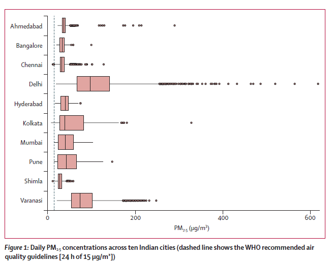
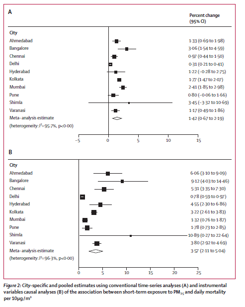
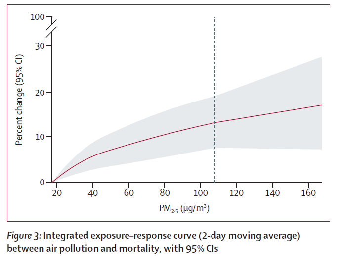

# PM25 : Specific Sections of Article Explained
Report Link : [Ambient air pollution and daily mortality in ten cities of India: a causal modelling study](https://www.thelancet.com/journals/lanplh/article/PIIS2542-5196(24)00114-1/fulltext)

## Plot Analysis :  boxplot illustrating the daily PM2.5 concentrations across ten Indian cities.

### Plot Components
- Cities: The y-axis lists the ten Indian cities: Ahmedabad, Bangalore, Chennai, Delhi, Hyderabad, Kolkata, Mumbai, Pune, Shimla, and Varanasi.
- PM2.5 Concentrations: The x-axis represents the PM2.5 concentrations in micrograms per cubic meter (µg/m³).
- WHO Guideline: The vertical dashed line at 15 µg/m³ indicates the WHO recommended air quality guideline for 24-hour PM2.5 concentrations.

### Boxplot Details
#### For each city:
- Median: The central line in each box represents the median PM2.5 concentration.
- Interquartile Range (IQR): The box itself represents the interquartile range, which is the range between the 25th and 75th percentiles. This shows the middle 50% of the data.
- Whiskers: The lines extending from the box (whiskers) represent the range of the data excluding outliers, typically calculated as 1.5 times the IQR.
- Outliers: The dots beyond the whiskers represent outliers, which are data points that fall outside the whiskers.

#### Observations
- High Pollution Levels: Cities like Delhi, Kolkata, and Varanasi show significantly high PM2.5 concentrations with medians well above the WHO guideline of 15 µg/m³. Delhi, in particular, has a very high median concentration and a wide range of values, including many extreme outliers.
- Moderate Pollution Levels: Cities like Ahmedabad, Chennai, and Hyderabad also exceed the WHO guideline but to a lesser extent compared to Delhi.
- Lower Pollution Levels: Bangalore, Mumbai, Pune, and Shimla have lower PM2.5 concentrations, with some days exceeding the WHO guideline but generally maintaining lower median values.

### Conclusion
The boxplot highlights the severity of PM2.5 pollution in various Indian cities, with Delhi showing the highest levels. It visually underscores the need for stringent air quality control measures in cities where PM2.5 levels frequently exceed safe limits recommended by the WHO.

## Plot Analysis :  Instrumental Variables Causal Analyses.

### Plot A : Instrumental Variables Causal Analyses
#### Plot Components:
- Cities: Listed on the left side, including Ahmedabad, Bangalore, Chennai, Delhi, Hyderabad, Kolkata, Mumbai, Pune, Shimla, and Varanasi.
- Percent Change (95% CI): Percent change in daily mortality per 10 µg/m³ increase in PM2.5 concentration, with 95% confidence intervals (CI) shown as horizontal lines.
- Meta-Analysis Estimate: Combined estimate across all cities, shown at the bottom with an overall percent change and 95% CI.

#### Observations:
- Ahmedabad: 1.33% increase (0.69 to 1.98)
- Bangalore: 3.06% increase (1.54 to 4.59)
- Chennai: 0.97% increase (0.44 to 1.50)
- Delhi: 0.31% increase (0.21 to 0.41)
- Hyderabad: 1.22% increase (-0.28 to 2.75)
- Kolkata: 1.77% increase (1.47 to 2.07)
- Mumbai: 2.41% increase (1.85 to 2.98)
- Pune: 0.80% increase (-0.06 to 1.66)
- Shimla: 3.45% increase (-3.32 to 10.69)
- Varanasi: 1.17% increase (0.49 to 1.86)
###### Meta-Analysis Estimate: 1.42% increase (0.67 to 2.19), with a high degree of heterogeneity (I² = 95.7%, p < 0.00)

### Panel B: Instrumental Variables Causal Analyses
#### Components:
- Cities: Listed on the left side, same as in Panel A.
- Percent Change (95% CI): Percent change in daily mortality per 10 µg/m³ increase in PM2.5 concentration, with 95% confidence intervals (CI) shown as horizontal lines.
- Meta-Analysis Estimate: Combined estimate across all cities, shown at the bottom with an overall percent change and 95% CI.

#### Observations:
- Ahmedabad: 6.06% increase (3.10 to 9.09)
- Bangalore: 9.12% increase (4.03 to 14.46)
- Chennai: 5.31% increase (3.35 to 7.30)
- Delhi: 0.78% increase (0.59 to 0.97)
= Hyderabad: 4.55% increase (2.30 to 6.86)
- Kolkata: 3.22% increase (2.61 to 3.83)
- Mumbai: 1.32% increase (0.76 to 1.87)
- Pune: 1.78% increase (0.73 to 2.85)
- Shimla: 10.89% increase (0.27 to 22.64)
- Varanasi: 3.80% increase (2.92 to 4.69)
###### Meta-Analysis Estimate: 3.57% increase (2.11 to 5.04), with a high degree of heterogeneity (I² = 96.3%, p < 0.00)

###Key Points:
- Panel A shows the results from conventional time-series analyses.
- Panel B shows the results from instrumental variable causal analyses, which typically provide stronger associations as they attempt to isolate the causal effect of locally generated PM2.5.
- Heterogeneity: Both panels show a high degree of heterogeneity, indicating variability in the effect estimates across different cities.

### Interpretation:
- The results indicate that short-term exposure to PM2.5 is associated with increased daily mortality in the studied cities.
- The instrumental variable analysis (Panel B) shows generally higher percent changes in mortality compared to the conventional analysis (Panel A), suggesting a stronger effect when accounting for local pollution sources.
- The meta-analysis estimates provide an overall summary effect, indicating a statistically significant association between PM2.5 and mortality across the cities.

##### This plot helps in understanding the varying impact of PM2.5 on mortality in different urban contexts within India and underscores the importance of using advanced analytical methods to assess the true burden of air pollution on public health.

## Plot Analysis :  Integrated exposure–response curve (2-day moving average).

#### Plot Components
- X-Axis (PM2.5 µg/m³): This axis represents the concentration of PM2.5 in micrograms per cubic meter (µg/m³).
- Y-Axis (Percent change (95% CI)): This axis shows the percent change in mortality associated with different levels of PM2.5 exposure, along with the 95% confidence intervals.

#### Key Elements
- Red Line: This line represents the estimated percent change in mortality associated with different levels of PM2.5 exposure.
- Grey Shaded Area: This area represents the 95% confidence intervals around the estimated percent change in mortality. It provides a range within which the true percent change is likely to fall.
- Vertical Dashed Line at 120 µg/m³: This line represents the 99th percentile of PM2.5 concentrations observed in the study. It highlights that most data points lie below this concentration.
- Minimum Air Pollution Concentration (17.1 µg/m³): The plot uses 17.1 µg/m³ as the minimum concentration at which an effect was observed. This is because the WHO 24-hour ambient PM2.5 guideline of 15 µg/m³ was rarely observed in the dataset.

#### Observations
- Rising Trend: The curve shows that as PM2.5 concentration increases, the percent change in mortality also increases. This indicates a positive association between PM2.5 exposure and mortality.
- Steeper Slope at Lower Levels: The curve is steeper at lower levels of PM2.5 concentration and starts to plateau at higher concentrations. This suggests that the relative increase in mortality risk is higher at lower levels of exposure and becomes less pronounced as PM2.5 levels increase.
- Confidence Intervals: The grey shaded area widens as PM2.5 concentration increases, indicating greater uncertainty in the estimates at higher levels of PM2.5 exposure.

#### Interpretation
The plot demonstrates that short-term exposure to PM2.5 is associated with an increased risk of mortality, even at concentrations below the current Indian standard of 60 µg/m³. The steep slope at lower levels of PM2.5 exposure indicates that reducing PM2.5 concentrations, even slightly, can have significant public health benefits by reducing mortality rates.

#### Policy Implications
- No Safe Threshold: The absence of a flat portion in the curve suggests that there is no safe threshold for PM2.5 exposure; even low levels are associated with increased mortality.
- Importance of Reducing PM2.5: Efforts to reduce PM2.5 concentrations can yield significant health benefits, especially in areas with high pollution levels.

## Conclusion
###### The plots provide strong evidence of the harmful effects of PM2.5 on mortality and underscores the importance of air quality management to protect public health. It visually communicates that even small reductions in PM2.5 levels can lead to meaningful decreases in mortality risk.
